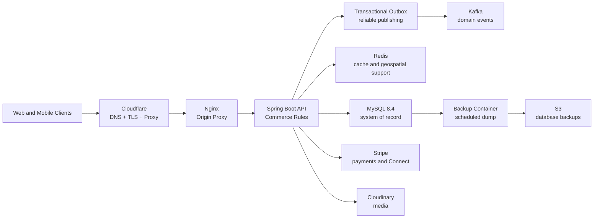
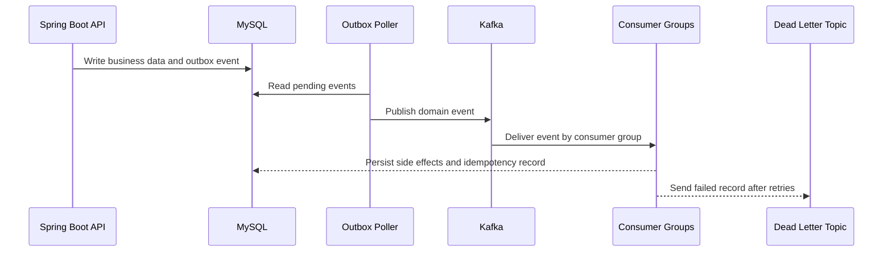

# AfroChow Commerce API Platform

AfroChow Commerce API Platform is the Spring Boot backend behind AfroChow, a Canadian marketplace for African restaurants, food vendors, customers, and marketplace operators.

The API owns the commercial backbone of the product: authentication, customer and vendor workflows, stores, menus, carts, orders, payments, vendor payouts, notifications, geocoding, image uploads, metrics, backups, and event processing. It is built as a production ready service that can run on a VPS through Docker Compose, Cloudflare, Nginx, MySQL, Kafka, Redis, and scheduled S3 database backups.

## What This Backend Powers

| Domain | Capability |
| --- | --- |
| Customers | Account flows, vendor discovery, checkout, orders, payment status, address data, and notifications. |
| Vendors | Store onboarding, menu management, order handling, earnings, Stripe Connect onboarding, and profile management. |
| Admins | Vendor approval, customer and vendor management, platform metrics, and operational oversight. |
| Platform operations | Kafka domain events, Redis runtime support, metrics, Docker deployment, and scheduled S3 backups. |

## Business Summary

AfroChow is built around marketplace reliability:

- Customers should be able to discover vendors before signing in.
- Vendors need a practical dashboard for menus, orders, payout setup, and earnings.
- Payment and notification workflows should be reliable even when outside providers slow down.
- Admins need enough visibility to approve vendors and protect marketplace quality.
- The system should run affordably on an MVP VPS while keeping a path open for future worker separation.

## Platform Capabilities

| Area | Implementation |
| --- | --- |
| Authentication | JWT based account flows with login rate limiting and account lockout after repeated failures. |
| Commerce | Customer, vendor, store, menu, product, order, payment, and payout APIs. |
| Payments | Stripe checkout and Stripe Connect workflows. |
| Media | Cloudinary backed image upload workflows. |
| Messaging | Notification creation and delivery workflows through event processing. |
| Location | Address geocoding and fulfillment support. |
| Events | Transactional outbox publishing, Kafka consumers, retries, and dead letter topics. |
| Runtime support | Redis cache and geospatial support. |
| Operations | Prometheus metrics endpoint, Docker deployment, and scheduled database backups. |

## System Design



Only HTTP(S) is public. MySQL, Kafka, Redis, backup jobs, and Kafka UI should stay private behind Docker networking, localhost bindings, firewall rules, or SSH tunnels.

## Event Pipeline

AfroChow uses the transactional outbox pattern for background work. Application code writes business data and domain events to MySQL in one transaction. A poller publishes pending events to Kafka. Consumer groups then process their own workloads independently.



Current event streams:

```text
afrochow.domain-events
afrochow.domain-events.retry
afrochow.domain-events.dlq
```

Current consumer groups:

```text
afrochow-notification-service
afrochow-address-geocoding-service
afrochow-payment-transfer-service
```

Today the HTTP API, outbox poller, and Kafka consumer groups run inside one Spring Boot deployable. Kafka offset isolation means each group can later move into its own service without changing the event contract.

## Core Services

| Service | Role |
| --- | --- |
| `app` | Spring Boot API and in process consumers. |
| `nginx` | Public reverse proxy and TLS origin. |
| `mysql` | Primary relational database. |
| `kafka` | Domain event broker. |
| `kafka-init` | Topic creation job. |
| `redis` | Cache and geospatial support. |
| `db-backup` | Scheduled MySQL dump and S3 upload worker. |
| `kafka-ui` | Private Kafka inspection UI. |

## Local Development

Prerequisites:

- Java 21
- Docker Desktop
- MySQL 8 compatible database
- Maven wrapper included in the repo

Start local infrastructure:

```bash
docker compose -f docker-compose.prod.yml up -d kafka kafka-init redis
```

Point `JAVA_HOME` at a JDK 21 install on macOS:

```bash
export JAVA_HOME=$(/usr/libexec/java_home -v 21)
```

Compile the backend:

```bash
./mvnw -q -DskipTests compile
```

Run the app:

```bash
./mvnw spring-boot:run
```

Local `.env` and production `.env.prod` files must stay private. Use `.env.prod.example` as the reference for required production values.

## API Documentation

The API uses springdoc OpenAPI. The app is mounted under `/api`.

```text
Swagger UI:       http://localhost:8080/api/swagger-ui.html
Raw OpenAPI:      http://localhost:8080/api/v3/api-docs
Local BootUI:     http://localhost:8080/api/bootui
```

Swagger UI is protected outside local environments. BootUI is available only in local or dev profiles and is intended for health, metrics, JVM, database pool, cache, log, and advisor inspection.

Export the OpenAPI spec:

```bash
./scripts/export-openapi.sh
```

## Testing

Run the full suite:

```bash
./mvnw test
```

The backend includes unit and Spring MVC slice tests across controllers, services, and security components. H2 supports repository adjacent tests so most of the suite can run without external infrastructure.

The Maven build enforces Java 21, and the dependency check plugin runs OWASP vulnerability scanning against dependencies.

## Production Shape

Production runs through Docker Compose with these major pieces:

- Cloudflare for DNS, proxying, and edge TLS.
- Nginx as the origin reverse proxy.
- Spring Boot app container, which also runs the outbox poller and Kafka consumer groups today.
- MySQL, Kafka, Redis, and backup containers.
- Private Kafka UI over SSH tunnel only.
- Scheduled MySQL backups to S3.

Useful production files:

| Path | Purpose |
| --- | --- |
| `docker-compose.prod.yml` | Production container topology. |
| `Dockerfile` | Spring Boot app image. |
| `deploy/nginx/` | Nginx origin proxy config. |
| `deploy/backup/` | Database backup image and scripts. |
| `.env.prod.example` | Example production environment contract. |

Deployment details, credentials, certificates, server IPs, and operational runbooks are intentionally kept outside the public README.

## CI CD

Production deploys are handled by GitHub Actions through `.github/workflows/deploy-production.yml`.

The workflow runs when `main` is pushed and can also be started manually from GitHub Actions. It compiles the application, connects to the VPS over SSH, pulls `origin/main` into `/opt/afrochow`, rebuilds the Docker Compose stack, and verifies the API health endpoint.

Required repository secrets:

| Secret | Purpose |
| --- | --- |
| `VPS_HOST` | Production VPS hostname or IP. |
| `VPS_SSH_KEY` | Private SSH key allowed to deploy on the VPS. |
| `VPS_USER` | SSH user, usually `root`. |
| `VPS_PORT` | SSH port, optional when using `22`. |

The VPS keeps private runtime files outside Git, including `.env.prod` and Cloudflare origin certificates.

## Security Notes

Never commit:

```text
.env
.env.prod
AWS access keys
Cloudflare origin private keys
JWT secrets
Stripe secrets
Google OAuth secrets
database dumps
uploaded user files
```

The repository keeps deployable infrastructure code, but excludes private runtime artifacts such as real environment files, certificate keys, uploaded files, and backup dumps.

## Recruiter Notes

AfroChow Commerce API Platform demonstrates production backend depth:

- Commerce domain modeling across customers, vendors, stores, menus, orders, payments, payouts, and admin operations.
- Event based architecture using Kafka and the transactional outbox pattern.
- Payment integration with Stripe and vendor payout onboarding through Stripe Connect.
- Runtime and operations awareness across Cloudflare, Nginx, Docker, MySQL, Redis, Kafka, Prometheus metrics, and S3 backups.
- Security and reliability concerns including JWT auth, login rate limiting, account lockout, private runtime secrets, retry topics, and dead letter queues.
- A practical path to scale from one Spring Boot deployable to separate worker services later.

## License

Proprietary. All rights reserved. This code is not licensed for reuse, redistribution, or derivative works without written permission.
