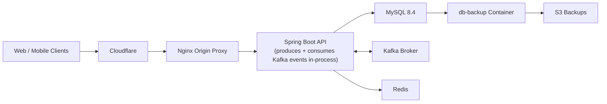
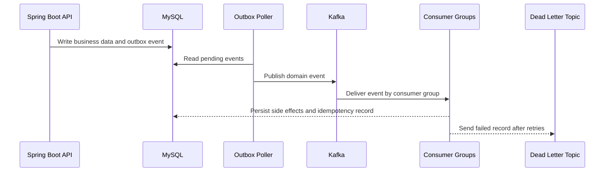

# Afrochow Backend


Afrochow Backend is the Spring Boot API behind the Afrochow marketplace. It powers authentication, customer and vendor workflows, stores, menus, orders, payments, notifications, address geocoding, file uploads, and event-driven background processing.

Production is containerized with Docker Compose and sits behind Cloudflare and Nginx, with MySQL, Kafka, Redis, and scheduled S3 database backups.

## Table Of Contents

- [Architecture](#architecture)
- [Core Services](#core-services)
- [Backend Capabilities](#backend-capabilities)
- [Event Pipeline](#event-pipeline)
- [Local Development](#local-development)
- [API Documentation](#api-documentation)
- [Testing](#testing)
- [Production Shape](#production-shape)
- [CI/CD](#cicd)
- [Security Notes](#security-notes)
- [License](#license)

## Architecture



Only the HTTP(S) edge is public. Internal services such as MySQL, Kafka, Redis, the backup container, and Kafka UI are kept behind the Docker network, localhost bindings, or SSH tunnels.

**Note on the `app` node:** there is a single Spring Boot deployable — one `app` container runs the HTTP API, the outbox poller, and all Kafka consumer groups in the same JVM. There is currently no separate worker service; the earlier version of this diagram implied one and was misleading. Kafka's per-consumer-group offset tracking already isolates the workloads logically, so splitting a consumer group into its own deployable later is a config change, not a rewrite — but as of today it's all one process.

## Core Services

| Service | Role |
| --- | --- |
| `app` | Spring Boot API |
| `nginx` | Public reverse proxy and TLS origin |
| `mysql` | Primary relational database |
| `kafka` | Domain event broker |
| `kafka-init` | Topic creation job |
| `redis` | Cache and geospatial store support |
| `db-backup` | Scheduled MySQL dump and S3 upload worker |
| `kafka-ui` | Private Kafka inspection UI |

## Backend Capabilities

- JWT-based authentication and account flows, with login rate limiting and account lockout after repeated failures (OWASP ASVS V2.2.1)
- Customer, vendor, store, menu, product, and order APIs
- Image uploads via Cloudinary
- Stripe-backed payment workflows
- Notification creation and delivery workflows
- Address geocoding and fulfillment support
- Transactional outbox event publishing
- Kafka consumers with idempotency checks
- Redis-backed runtime support
- Distributed scheduler locking (ShedLock) so scheduled jobs stay safe if the app ever scales to multiple instances
- Prometheus-format metrics at `/actuator/prometheus` (JWT-authenticated, same as other non-public actuator endpoints) — not yet scraped by a running Prometheus/Grafana stack, but curlable for manual debugging today
- Dockerized production deployment
- Scheduled database backups

## Event Pipeline

Afrochow uses a transactional outbox pattern for background work. Application code writes domain events to the database, a poller publishes them to Kafka, and independent consumer groups process their own workloads.



Current event stream conventions:

```text
afrochow.domain-events
afrochow.domain-events.retry
afrochow.domain-events.dlq
```

Current consumer groups:

```text
afrochow-notification-service
afrochow-address-geocoding-service
afrochow-payment-transfer-service
```

One Kafka topic can serve multiple consumer groups safely. Each group tracks its own offsets and receives its own logical copy of each event.

All three consumer groups currently run in-process inside the same `app` deployable as the API — there is no separate worker service today. The offset isolation above means a group can be pulled out into its own service later without changing the event contract.

## Local Development

Prerequisites:

- Java 21
- Docker Desktop
- MySQL 8 compatible database
- Maven wrapper included in the repo

Start local infrastructure:

```bash
docker compose -f docker-compose.prod.yml up -d kafka kafka-init redis
```

The Maven build enforces Java 21 exactly (`maven-enforcer-plugin`). On macOS, point `JAVA_HOME` at a JDK 21 install before running Maven:

```bash
export JAVA_HOME=$(/usr/libexec/java_home -v 21)
```

Compile the backend:

```bash
./mvnw -q -DskipTests compile
```

Run the app with your local Spring profile and environment values:

```bash
./mvnw spring-boot:run
```

Local `.env` and production `.env.prod` files must stay private. Use `.env.prod.example` as the shape reference for required variables.

### Local Developer Console (BootUI)

In the `dev` profile (or whenever `spring-boot-devtools` is on the classpath), [BootUI](https://www.julien-dubois.com/boot-ui/) is available at `http://localhost:8080/api/bootui` — a local-only console for health, metrics, JVM/DB pool/cache inspection, log tail, and Spring/Hibernate/security advisors. It's loopback-only and force-disables itself outside `dev`/`local` profiles, so it never activates in production.

## API Documentation

The API is self-documented with [springdoc-openapi](https://springdoc.org/). The app is mounted under `/api` (`server.servlet.context-path=/api`), so with the app running locally:

- Swagger UI: `http://localhost:8080/api/swagger-ui.html`
- Raw OpenAPI spec: `http://localhost:8080/api/v3/api-docs`

Swagger UI is protected in non-local environments (see `SwaggerAuthConfig`). To export the spec to a file for sharing or client-generation purposes:

```bash
./scripts/export-openapi.sh
```

This starts the app against local infrastructure, pulls the spec from `/api/v3/api-docs`, and writes it to `openapi.json` in the repo root.

## Testing

The service ships with unit and Spring MVC slice tests across controllers, services, and security components (`AbstractControllerTest` / `ControllerSliceTest` provide shared test scaffolding). H2 backs repository-adjacent tests so the suite runs without external infrastructure.

Run the full suite:

```bash
./mvnw test
```

`maven-enforcer-plugin` pins builds to Java 21, and `dependency-check-maven` runs an OWASP vulnerability scan against dependencies as part of the build.

## Production Shape

Production runs through Docker Compose with these major pieces:

- Cloudflare for public DNS, proxying, and edge TLS
- Nginx as the origin reverse proxy
- Spring Boot app container (also runs the outbox poller and all Kafka consumer groups — see [Event Pipeline](#event-pipeline))
- MySQL, Kafka, Redis, and backup containers
- Private Kafka UI over SSH tunnel only
- Scheduled MySQL backups to S3

Useful production files:

| Path | Purpose |
| --- | --- |
| `docker-compose.prod.yml` | Production container topology |
| `Dockerfile` | Spring Boot app image |
| `deploy/nginx/` | Nginx origin proxy config |
| `deploy/backup/` | Database backup image and scripts |
| `.env.prod.example` | Example production environment contract |

Deployment details, credentials, certificates, server IPs, and operational runbooks are intentionally kept outside the public README.

## CI/CD

Production deploys are handled by GitHub Actions through `.github/workflows/deploy-production.yml`.

The workflow runs when `main` is pushed, and can also be started manually from the GitHub Actions tab. It compiles the application, connects to the VPS over SSH, pulls `origin/main` into `/opt/afrochow`, rebuilds the Docker Compose stack, and verifies the API health endpoint.

Required repository secrets:

| Secret | Purpose |
| --- | --- |
| `VPS_HOST` | Production VPS hostname or IP |
| `VPS_SSH_KEY` | Private SSH key allowed to deploy on the VPS |
| `VPS_USER` | SSH user, usually `root` |
| `VPS_PORT` | SSH port, optional when using `22` |

The VPS keeps private runtime files outside Git, including `.env.prod` and Cloudflare origin certificates.

## Security Notes

Never commit:

```text
.env
.env.prod
AWS access keys
Cloudflare origin private keys
JWT secrets
Stripe secrets
Google OAuth secrets
database dumps
uploaded user files
```

The repository keeps deployable infrastructure code, but excludes private runtime artifacts such as real environment files, cert keys, uploaded files, and backup dumps.

## License

Proprietary. All rights reserved — this code is not licensed for reuse, redistribution, or derivative works without written permission.
